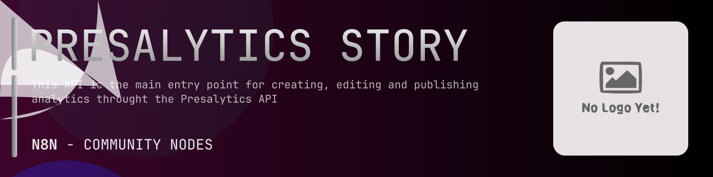

# @n8n-dev/n8n-nodes-presalytics-story



[](https://www.npmjs.com/package/@n8n-dev/n8n-nodes-presalytics-story)
[](https://opensource.org/licenses/MIT)

---

**Stop writing presalytics-story API integrations by hand.**

Every time you connect n8n to presalytics-story, you waste hours mapping endpoints, defining parameters, and debugging schemas. You copy-paste from docs, fix edge cases, and pray nothing breaks.

**What if connecting n8n to presalytics-story took 5 minutes, not half a day?**

This node gives you **11+ resources** out of the box: **Story**, **Cache**, **Restricted**, **Schemas**, **Permissions**, and 6 more: with full CRUD operations, typed parameters, and zero manual configuration.

---

## What You Get

- **Zero boilerplate**: Resources, operations, and fields are pre-configured and ready to use
- **Full CRUD**: Create, read, update, and delete support where the API allows it
- **Typed parameters**: No more guessing field types
- **Built-in auth**: API key authentication, ready to go
- **Declarative**: Native n8n performance, no custom execute() overhead

---

## Install

```bash
npm install @n8n-dev/n8n-nodes-presalytics-story
```

**Or in n8n:**
1. **Settings → Community Nodes → Install**
2. Search: `@n8n-dev/n8n-nodes-presalytics-story`
3. Click **Install**

---

## Quick Start

1. Install the node (above)
2. Add credentials: **presalytics-story API** → paste your API key
3. Drag the **presalytics-story** node into your workflow
4. Pick a resource → pick an operation → done.

That's it. No configuration files. No code. It just works.

---

## Resources

<details>
<summary><b>Story</b> (16 operations)</summary>

- Get Story Get List of User Stories
- Post Story Upload
- Post Story Upload a File
- Post Story Upload a File base64
- Delete Story Delete by ID
- Get Story Get by ID
- Put Story Modify
- Get Story View Analytics
- Post Story Upload a File To Existing Story
- Delete Story Delete Subdocument
- Get Story Download Updated File
- Get Story Get Story Outline
- Post Story Post Story Outline
- Get Story Public Link to Story Reveal js Document
- Get Story Get Story at Reveal js Document
- Get Story Get Story Status

</details>

<details>
<summary><b>Cache</b> (2 operations)</summary>

- Post Cache Store Subdocument
- Get Cache Get Subdocument

</details>

<details>
<summary><b>Restricted</b> (1 operations)</summary>

- Post Collborators Bulk Update Admin Only

</details>

<details>
<summary><b>Schemas</b> (1 operations)</summary>

- Get Story Outline Schema

</details>

<details>
<summary><b>Permissions</b> (2 operations)</summary>

- Get Permissions List Permission Types
- Get Permissions Story Authorization for a User

</details>

<details>
<summary><b>Sessions</b> (4 operations)</summary>

- Delete Sessions Delete by ID
- Get Sessions Get
- Get Sessions List Story Sessions
- Post Sessions Create a Session

</details>

<details>
<summary><b>Views</b> (4 operations)</summary>

- Get Views List Session Views
- Post Views Create A Session View
- Delete Views Delete by ID
- Get Views Get View

</details>

<details>
<summary><b>Story Collaborators</b> (6 operations)</summary>

- Get Story Collaborators List
- Post Story Collaborators Add New User
- Post Story Collaborators Edit Inactive User Permission
- Delete Story Collaborators Remove User
- Get Story Collaborators Access Permissions
- Put Story Collaborators Edit Access Rights

</details>

<details>
<summary><b>Events</b> (2 operations)</summary>

- Get Events List Events
- Post Events Manage Events

</details>

<details>
<summary><b>Conversation</b> (2 operations)</summary>

- Get Conversation List Conversation Messages
- Post Conversation Send a Message

</details>

<details>
<summary><b>Default</b> (2 operations)</summary>

- Get Environment Get
- Get Specification No tags

</details>

---

## Why This Node?

**Without this node:**
- Hours of manual API integration
- Copy-pasting from presalytics-story docs
- Debugging auth, pagination, error handling
- Maintaining your own client code

**With this node:**
- Install → configure → use. 5 minutes.
- Auto-generated from the official presalytics-story OpenAPI spec
- Always up to date when the API changes
- Native n8n performance

---

## Auto-Generated
This node was auto-generated from the official **presalytics-story** OpenAPI specification using
[@n8n-dev/n8n-openapi-node-ultimate](https://github.com/kelvinzer0/n8n-openapi-node-ultimate),
then validated against the live API so you get accurate types and real parameters, not guesswork.

When the presalytics-story API updates, this node updates too.

---

## Support This Project

If this node saved you hours of work, consider supporting continued development, new APIs, better error handling, and faster updates.

[](https://n8n-code.github.io/membership/#/eyJ0aXRsZSI6IktlZXAgSXQgTW92aW5nIiwiZGVzYyI6Ik9uZSBkZXZlbG9wZXIgYnVpbHQgYSB0b29sIHRoYXQgYXV0by1nZW5lcmF0ZXNcbm44biBub2RlcyBmcm9tIGFueSBPcGVuQVBJIHNwZWMuXG5cbllvdXIgZG9uYXRpb24gZnVuZHMgbmV3IGZlYXR1cmVzLCBtb3JlIEFQSSBzdXBwb3J0LFxuYW5kIGJldHRlciB0b29saW5nIGZvciBldmVyeSBkZXZlbG9wZXIgYWZ0ZXIgeW91LiIsInRhcmdldCI6NTAwMCwiYWRkcmVzc2VzIjp7ImV0aGVyZXVtIjoiMHhmMDU1NWQ0MGRiRkI0ZTNCZjA3MDQ0MjgyQjc4RjJmRTFmNTFFZjcyIiwic29sYW5hIjoiNlpEVk5BYmpZZExEcXo4cGt3VUNHYllaNVV3QlFranB0QzU1Wk5vTFcybVUifSwiZGlzY29yZCI6Imh0dHBzOi8vZGlzY29yZC5nZy9wdERaOGU0aDkzIn0)

---

## License

MIT © [kelvinzer0](https://github.com/n8n-code)
